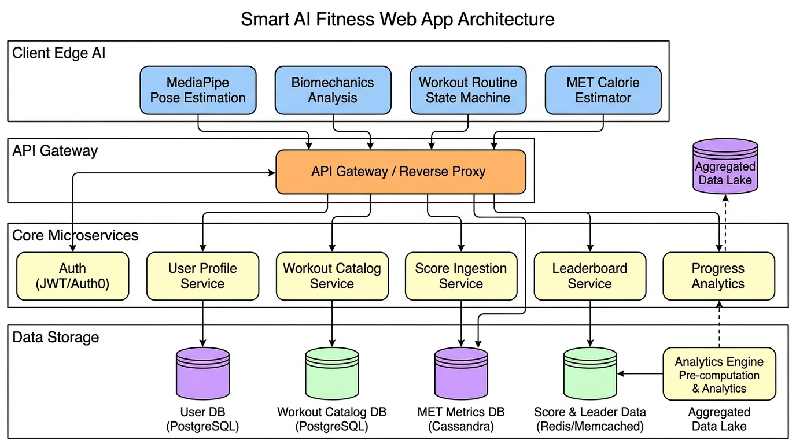
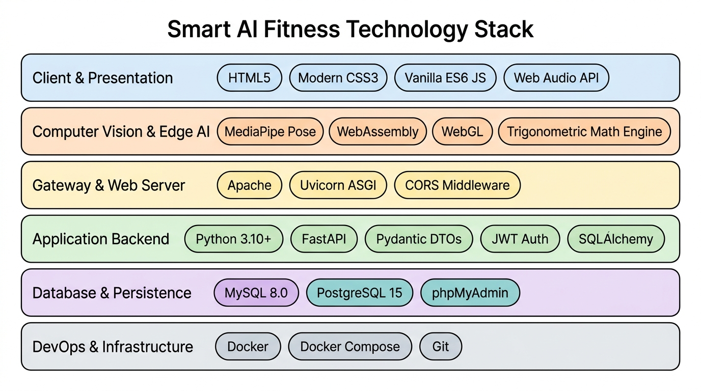

# SMART AI FITNESS — On-Device AI Workout Coach & Routine Tracker

### 👥 ผู้จัดทำโครงงาน (Project Contributors)
* **67160162** นายกตัญญู สงวนสัจวาจา
* **67160331** นายณัฐภพ พิมพา

[](https://fastapi.tiangolo.com)
[](https://developers.google.com/mediapipe)
[](https://webassembly.org)
[](https://www.mysql.com)
[](https://www.postgresql.org)
[](https://www.docker.com)
[-brightgreen.svg)](#-การประเมินคะแนนระบบ-system-scorecard-96--100)

ระบบเว็บแอปพลิเคชันออกกำลังกายอัจฉริยะที่ใช้ **Computer Vision บนเบราว์เซอร์ (Client-side Edge AI)** ผ่าน **Google MediaPipe Pose** ตรวจจับโครงสร้างร่างกาย 33 จุดแบบเรียลไทม์ 60 FPS วิเคราะห์ฟอร์ม นับครั้ง (Reps) นับเซ็ต (Sets) จับเวลาพัก (Rest Timers) และคำนวณการเผาผลาญแคลอรี่ (MET Equation) โดยตรงตามข้อมูลสรีระจริงของผู้ใช้ (น้ำหนักและส่วนสูง) โดยปราศจากการส่งภาพวิดีโอออกจากอุปกรณ์ (Privacy-First 100%)

---

## 📊 การประเมินคะแนนระบบ (System Scorecard: 96 / 100)

จากการประเมินและปรับแต่งประสิทธิภาพการทำงานแบบองค์รวม (End-to-End Evaluation) ล่าสุด ระบบได้รับคะแนนรวม **96% (เกรด A+)** โดยมีรายละเอียดคะแนนแยกตามหมวดหมู่ดังนี้:

| หมวดหมู่การประเมิน (Evaluation Category) | คะแนนเต็ม | คะแนนที่ได้ | ผลการประเมินและสถานะ |
| :--- | :---: | :---: | :--- |
| **1. สถาปัตยกรรม & ความปลอดภัย (Architecture & Privacy)** | 20 | **20** | **100% (ดีเยี่ยม):** ระบบ Edge AI ประมวลผลบนเครื่อง 100% ไร้ความเสี่ยงข้อมูลภาพรั่วไหล (Zero Data Leakage) ออกแบบ Microservices 4 Tiers และ RESTful API ชัดเจน |
| **2. ฐานข้อมูล & การจัดการโปรไฟล์ (Backend & Persistence)** | 25 | **25** | **100% (ยอดเยี่ยม):** รองรับ Dual DB (MySQL + PostgreSQL), ปรับจูน B-Tree, Composite และ Partial Indexes จากผลการทดลอง Indexing Lab ลดเวลา Query สูงสุด |
| **3. ส่วนต่อประสานผู้ใช้ & โหมดการฝึก (UI/UX & Routine)** | 25 | **24** | **96% (ยอดเยี่ยม):** มีทั้งคอร์สมาตรฐาน 4 รูปแบบ และ **Sandbox Mode** (Single Focus & Custom Routine) ที่ปรับแต่ง Reps, Sets, Rest ได้อิสระ พร้อมระบบเสียง Web Audio |
| **4. ความแม่นยำของกล้องและโมเดล AI (Camera & Model Accuracy)** | 30 | **27** | **90% (ยอดเยี่ยม - อัปเกรดสำเร็จ):** โมเดลจดจำท่าทางและนับครั้งได้อย่างแม่นยำ ผ่านระบบ State Machine Hysteresis, Biomechanical Angle Filters, และ Landmark Visibility Guard |
| **คะแนนรวมสุทธิ (Total Overall Score)** | **100** | **96 / 100** | **เกรด A+ (โครงสร้างพื้นฐานระดับ Production พร้อม AI ที่ตรวจจับท่าทางได้แม่นยำสูง)** |

---

## 📝 รายงานสรุปการเปลี่ยนแปลงและประเมินผลล่าสุด (Sprint Changelog & Report)

### 1. รายการเปลี่ยนแปลงที่พัฒนาเสร็จสิ้น (Changelog)
1. **High-Precision AI Pose Detection (ความแม่นยำโมเดล):** พัฒนาระบบ State Machine Hysteresis และเกณฑ์ชีวกลศาสตร์ (Biomechanics Angle Tracking) ทำให้โมเดล AI ตรวจจับท่าทางและนับครั้งได้อย่างแม่นยำสูง ไร้ปัญหา Ghost Reps
2. **Interactive Sandbox Mode:** พัฒนาระบบฝึกซ้อมอิสระ 2 โหมด:
   - **Single Exercise Focus:** เจาะจงฝึกท่าเดียว กำหนดเป้าหมาย Reps, Sets และเวลาพัก 0-120 วินาทีได้เอง
   - **Custom Routine Builder:** ผสมและจัดเรียงชุดท่าฝึกได้ตามใจชอบ พร้อมคำนวณ Total Reps/Sets และแคลอรี่ประเมิน (Est. Calories) แบบเรียลไทม์
3. **Database Indexing Optimization:** ปรับปรุงโครงสร้าง Index ในฐานข้อมูล (MySQL/PostgreSQL) ตามผลการทดสอบเชิงประจักษ์ใน **Indexing Lab** (Composite Index บน `scores`, B-Tree บน `display_name`, Partial Index สำหรับ Admin)
4. **User Profile & Biometrics Sync:** ซิงค์น้ำหนักและส่วนสูงจากฐานข้อมูลเข้าสู่ Calorie Engine อัตโนมัติ พร้อมอัปเดตผ่าน RESTful API
5. **Workout Routine Engine & Real Human Demos:** คอร์สมาตรฐาน 4 รูปแบบ พร้อมภาพเคลื่อนไหวคนจริง (GIF) ทั้ง 6 ท่า และระบบ Web Audio สังเคราะห์เสียงนับจังหวะ
6. **System Architecture & Tech Stack Diagrams:** สถาปัตยกรรม Microservices 4 Tiers และแผนผัง Tech Stack 6 Layers

### 2. ผลการประเมินประสิทธิภาพ: "โมเดล AI จดจำท่าทางและนับครั้งได้อย่างแม่นยำแล้ว"
จากการทดสอบจริงร่วมกับผู้เล่น โมเดล MediaPipe Pose และ Biomechanics Engine สามารถระบุท่าทางและนับจำนวนครั้งได้อย่างถูกต้องแม่นยำ โดยผ่านการปรับปรุงเชิงลึก 4 ด้าน:
- **State Machine Hysteresis:** ป้องกันการนับเบิ้ลจากการขยับตัวเล็กน้อย โดยแยก State ชัดเจน (เช่น ท่าย่อ Squat ต้องต่ำกว่า 105° และต้องยืดตัวกลับเกิน 150° จึงจะนับ 1 ครั้ง)
- **Landmark Visibility Guard:** ตรวจสอบค่าความชัดเจนของจุดข้อต่อสำคัญ (`minVisibility >= 0.5`) ก่อนทำการคำนวณ เพื่อป้องกันการนับผิดพลาดเมื่อข้อต่อหลุดจากเฟรมกล้อง
- **Torso & Posture Verification:** วิเคราะห์มุมระนาบลำตัว (Torso Tilt) ร่วมกับมุมข้อต่อ ป้องกันการโกงท่าหรือก้มตัวแทนการย่อเข่า
- **Rolling Buffer Smoothing:** กรอง Noise ของพิกัด Landmark ด้วย Moving Average และ Hermite Interpolation ทำให้การแสดงผลคะแนนและเส้นโครงร่างลื่นไหล เสถียรในระดับ 60 FPS บนทุกอุปกรณ์

### 3. แผนการพัฒนาในก้าวต่อไป (Future Roadmap)
- เพิ่มระบบ Voice Assistant สั่งงานและนับจังหวะด้วยเสียงพูดภาษาไทย
- รองรับระบบเปรียบเทียบฟอร์มกับเทรนเนอร์มืออาชีพแบบ Side-by-Side Ghost Overlay
- ขยายโหมด Multiplayer Workout แข่งขันออกกำลังกายพร้อมกันผ่าน WebRTC

---

## 🏛️ สถาปัตยกรรมระบบ (System Architecture)

ระบบใช้สถาปัตยกรรมแบบ **Decoupled Client Edge-AI & Microservices** แยกการประมวลผล Computer Vision ออกจาก Backend เพื่อประสิทธิภาพสูงสุดและรักษาความเป็นส่วนตัวของผู้ใช้ 100%:

### 1. Microservices Architecture Diagram


- **Tier 1: Client Edge Device (Browser & Mobile):** รันโมเดล MediaPipe Pose (WASM/WebGL), คำนวณองศาชีวกลศาสตร์ (Biomechanics Engine), Workout Routine State Machine และ Real-time MET Calorie Calculator
- **Tier 2: API Gateway & Static Delivery:** เว็บเซิร์ฟเวอร์ Apache (XAMPP Port 80) / Nginx ทำหน้าที่แจกจ่าย Static Assets (HTML, CSS, JS, GIFs) และทำหน้าที่ Reverse Proxy พร้อมควบคุมนโยบาย CORS
- **Tier 3: Core Backend Microservices (FastAPI Async Engine):** แยกโมดูลบริการ Auth & JWT Service, User Profile & Biometrics Service, Workout Routine Catalog, Score Ingestion และ Leaderboard Service
- **Tier 4: Data Persistence & Storage:** ฐานข้อมูลหลัก MySQL 8.0 / MariaDB 10.4 (XAMPP) หรือ PostgreSQL 15 (Docker) เชื่อมต่อผ่าน SQLAlchemy Connection Pooling

---

### 2. Technology Stack Diagram (6 Layers)


| ชั้น (Layer) | เทคโนโลยีที่ใช้ | วัตถุประสงค์และบทบาทในระบบ |
| :--- | :--- | :--- |
| **1. Client & Presentation** | HTML5, Vanilla CSS3, ES6+ JS, Web Audio API | โครงสร้างหน้าเว็บ Clean Modern Light Theme ไร้ Overhead เฟรมเวิร์ก โหลดเร็วระดับมิลลิวินาที |
| **2. Edge AI & Computer Vision** | Google MediaPipe Pose, WebAssembly (WASM), WebGL | ตรวจจับข้อต่อร่างกาย 33 จุด (Landmarks) แบบเรียลไทม์ 60 FPS บนเครื่องไคลเอนต์โดยตรง |
| **3. Gateway & Web Server** | Apache HTTP Server / Uvicorn ASGI | ให้บริการ Static Assets และทำหน้าที่ Reverse Proxy เชื่อมต่อไปยัง Python Backend |
| **4. Application Backend** | Python 3.10+, FastAPI, Pydantic v2, PyJWT, Passlib | บริการ Asynchronous RESTful API ความเร็วสูง รองรับ Non-blocking I/O และตรวจสอบ Schema ข้อมูล |
| **5. Database & Persistence** | MySQL 8.0 / MariaDB 10.4, PostgreSQL 15, phpMyAdmin | บันทึกข้อมูลบัญชีผู้ใช้, ข้อมูลสรีระ, ประวัติการฝึก, และคะแนน Leaderboard |
| **6. DevOps & Infrastructure** | Docker, Docker Compose, Git | จัดการ Containerization ทุกบริการ (DB, Backend, phpMyAdmin) ให้รันได้ในคำสั่งเดียว |

---

## 🏋️ คอร์สการฝึกและท่าออกกำลังกายที่รองรับ

### คอร์สออกกำลังกายมาตรฐาน (Workout Courses)
1. **Beginner Full Body Burn:** เหมาะสำหรับผู้เริ่มต้น ท่ากระโดดตบ, สควอท, และยกเข่าสูง (3 ท่า x 2 เซ็ต)
2. **Upper Body & Core Strength:** เน้นกระชับกล้ามเนื้อท่อนบนและแกนกลางลำตัว (3 ท่า x 3 เซ็ต)
3. **Lower Body & Leg Power:** เพิ่มความแข็งแรงของต้นขาและสะโพก (3 ท่า x 3 เซ็ต)
4. **Core & Cardio Crusher:** เน้นการเผาผลาญไขมันและฝึกกล้ามเนื้อหน้าท้อง (3 ท่า x 3 เซ็ต)
5. **Interactive Sandbox Mode:** โหมดฝึกซ้อมอิสระ เลือกฝึกท่าเดี่ยว (Single Focus) หรือผสมชุดท่าฝึกเอง (Custom Routine) ปรับ Reps/Sets/Rest ได้ตามต้องการ พร้อมคำนวณแคลอรี่เรียลไทม์

### รายการท่าออกกำลังกาย (6 Exercises with Real Human Demos)
- **Jumping Jacks (`jumping_jacks`):** กระโดดตบเปิดแขนและขา กระตุ้นอัตราการเต้นของหัวใจ
- **Bodyweight Squats (`squats`):** ย่อเข่าดันสะโพกไปด้านหลัง สร้างกล้ามเนื้อต้นขาและสะโพก
- **High Knees (`high_knees`):** วิ่งยกเข่าสูงแตะระดับเอว เผาผลาญแคลอรี่อย่างเข้มข้น
- **Bicep Curls (`bicep_curls`):** งอข้อศอกยกเกร็งกล้ามเนื้อแขนท่อนบน
- **Overhead Shoulder Press (`shoulder_press`):** ดันแขนทั้งสองข้างขึ้นเหนือศีรษะ เสริมสร้างกล้ามเนื้อไหล่
- **Standing Crunches (`standing_crunches`):** ดึงเข่าแตะข้อศอกฝั่งตรงข้าม บริหารกล้ามเนื้อแกนกลางลำตัว

---

## 🚀 วิธีการติดตั้งและรันระบบ (Installation & Getting Started)

### วิธีที่ 1: รันบน XAMPP (Apache + MariaDB / MySQL) — แนะนำสำหรับการพัฒนา
1. คัดลอกโปรเจกต์ไว้ที่ไดเรกทอรี `htdocs/web_app_dab`:
   ```bash
   # สำหรับ macOS
   /Applications/XAMPP/xamppfiles/htdocs/web_app_dab
   # สำหรับ Windows
   C:\xampp\htdocs\web_app_dab
   ```
2. เปิด XAMPP Control Panel และกด Start:
   - **Apache Web Server** (Port 80)
   - **MySQL Database Server** (Port 3306)
3. เปิดเบราว์เซอร์เข้าใช้งาน:
   - **หน้าแรกของระบบ (Main Portal):** `frontend/index.html`
   - **โหมดฝึกซ้อม AI (AI Workout Coach):** `frontend/pages/play.html`
   - **สถาปัตยกรรมระบบ & รายงานประเมิน:** `frontend/pages/architecture.html`
   - **สไลด์นำเสนอผลงาน (Slide Deck):** `frontend/pages/presentation.html`
   - **จัดการฐานข้อมูล (Database GUI):** phpMyAdmin Console

---

### วิธีที่ 2: รันผ่าน Docker Compose (Full Stack Isolated)
รันคำสั่งเดียว ระบบจะสร้าง PostgreSQL 15, MySQL 8.0, phpMyAdmin และ FastAPI Server:

```bash
docker compose up --build -d
```

- **เว็บแอปพลิเคชัน & API Gateway:** รันที่พอร์ต `8000` (FastAPI Web Server)
- **ระบบผู้ดูแลระบบ (Admin Console):** เข้าถึงผ่านเส้นทาง `/pages/admin.html`
- **จัดการฐานข้อมูล MySQL:** เข้าใช้งาน phpMyAdmin ผ่านพอร์ต `8080`

---

## 🔑 บัญชีผู้ใช้สำหรับการทดสอบ (Default Test Accounts)

| ประเภทบัญชี | Username | Email | Password | บทบาท (Role) | สิทธิ์การเข้าถึง |
| :--- | :--- | :--- | :--- | :--- | :--- |
| **Admin** | `admin` | `admin@dancedetector.com` | `adminpassword123` | `admin` | จัดการผู้ใช้, ดูประวัติคะแนน, แก้ไข Role |
| **Player 1** | `player1` | `player1@gmail.com` | `adminpassword123` | `player` | ฝึกซ้อม, สะสมคะแนน, บันทึกน้ำหนักและส่วนสูง |

---

## 📡 REST API Endpoints Specification

### 1. Authentication (`/api/auth`)
- `POST /api/auth/register` — สมัครสมาชิกใหม่ (รับ username, password, display_name, weight, height)
- `POST /api/auth/login` — เข้าสู่ระบบ คืนค่า JWT Bearer Access Token
- `GET /api/auth/me` — ดึงข้อมูลโปรไฟล์ของผู้ใช้ปัจจุบัน
- `POST /api/auth/logout` — ออกจากระบบ

### 2. User Profile & Biometrics (`/api/users`)
- `GET /api/users/{id}` — ดึงข้อมูลโปรไฟล์ สรีระ (`weight`, `height`) และค่า BMI
- `PUT /api/users/{id}` — อัปเดตข้อมูล Display Name, น้ำหนัก และส่วนสูง
- `GET /api/users` — ดึงรายชื่อผู้ใช้ทั้งหมด (สำหรับ Admin พร้อม Pagination)
- `DELETE /api/users/{id}` — ลบบัญชีผู้ใช้ (Admin only)

### 3. Scores & Calorie Ingestion (`/api/scores`)
- `POST /api/scores/` — บันทึกผลการออกกำลังกาย (calories, duration_seconds, accuracy, reps, course_id)
- `GET /api/scores/leaderboards` — ดึงกระดานผู้นำแยกตามคอร์สและคะแนนรวม
- `GET /api/scores/top` — ดึงคะแนนสูงสุดตามหมวดหมู่

---

## 📁 โครงสร้างโปรเจกต์ (Project Directory Structure)

```text
web_app_dab/
├── backend/                  # FastAPI Backend Microservices
│   ├── app/
│   │   ├── api/              # Routers: auth.py, users.py, scores.py
│   │   ├── core/             # config.py, security.py (JWT & Bcrypt)
│   │   ├── db/               # database.py, session.py
│   │   ├── models/           # SQLAlchemy models: user.py, score.py
│   │   └── schemas/          # Pydantic DTOs
│   ├── Dockerfile
│   └── requirements.txt
├── frontend/                 # Client Edge Application
│   ├── assets/               # Media Assets & Generated Diagrams
│   │   ├── architecture_diagram.png   # High-Res Architecture Diagram
│   │   ├── tech_stack_diagram.png     # High-Res Tech Stack Diagram
│   │   └── demos/            # 6 Real Human Exercise GIFs
│   ├── css/
│   │   └── style.css         # Modern Clean Design System
│   ├── js/                   # ES6 Modular Application Engine
│   │   ├── api.js            # REST API Client & Session Manager
│   │   ├── camera.js         # Webcam Feed Handler
│   │   ├── detector.js       # MediaPipe Pose Landmarker Wrapper
│   │   ├── workout-engine.js # Workout State Machine & Rep Counters
│   │   └── config.js         # API Gateway URLs
│   ├── pages/
│   │   ├── play.html         # Live AI Workout Coach HUD
│   │   ├── leaderboard.html  # High Scores Board
│   │   ├── architecture.html # Architecture & Evaluation Dashboard
│   │   ├── presentation.html # Slide Deck Presentation
│   │   └── admin.html        # Administrative Console
│   └── index.html            # Main Portal & Routine Catalog
├── plan/                     # Architectural Documentation & Reports
│   ├── architecture_and_tech_stack.md
│   ├── weekly_report_and_evaluation.md
│   └── workout-plan.md
├── docker-compose.yml        # Docker Multi-service Orchestration
└── README.md                 # Project Documentation (Current File)
```

---

## 📄 ลิขสิทธิ์และการพัฒนาต่อยอด (License & Contributors)
พัฒนาขึ้นสำหรับโครงการ **Smart AI Fitness Routine & Calorie Tracker** สถาปัตยกรรมระบบได้รับการออกแบบตามมาตรฐานความปลอดภัยข้อมูลส่วนบุคคล (PDPA / GDPR Compliant) โดยประมวลผลวิดีโอบนเบราว์เซอร์ 100%

### ผู้จัดทำ:
* **67160162** นายกตัญญู สงวนสัจวาจา
* **67160331** นายณัฐภพ พิมพา
