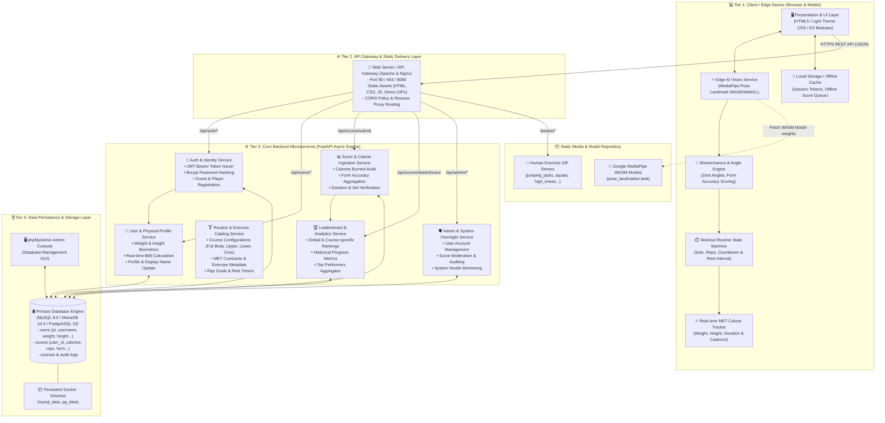

# Smart AI Fitness Workout Tracker — Architecture & Tech Stack

เอกสารสถาปัตยกรรมระบบ (Architecture Specification) และแผนผังเทคโนโลยี (Technology Stack Diagram) สำหรับระบบ **Smart AI Fitness Routine & Calorie Tracker**

---

## 1. แผนผังสถาปัตยกรรมไมโครเซอร์วิส (Microservices Architecture Diagram)

สถาปัตยกรรมของระบบได้รับการออกแบบตามแนวทาง **Decoupled Edge-AI & Microservices** โดยแยกภาระการประมวลผลวิดีโอแบบเรียลไทม์ (Real-time Vision AI) ไปประมวลผลบนเครื่องไคลเอนต์ของผู้ใช้ (Client-Side Edge Computing) และส่งเฉพาะข้อมูลผลลัพธ์สถิติ (Metrics & Telemetry) เข้าสู่บริการ Backend Services

---

## 2. แผนผังสแต็กเทคโนโลยี (Technology Stack Diagram)

โครงสร้างสแต็กเทคโนโลยีที่แบ่งตามเลเยอร์การทำงานตั้งแต่ Client-side ไปจนถึงโครงสร้างพื้นฐานระดับ DevOps:

```mermaid
graph LR
    subgraph L1 ["1. Client & Presentation Layer"]
        H5["📄 HTML5 (Semantic Structure)"]
        CSS["🎨 Modern CSS3 (Custom Tokens, Light Theme)"]
        JS["⚡ ES6+ Native JavaScript Modules"]
        WebAudio["🔊 Web Audio API (Workout Sound Synthesizer)"]
        CanvasAPI["🖌️ HTML5 Canvas 2D (Skeleton Overlay & Live HUD)"]
    end

    subgraph L2 ["2. Computer Vision & Edge AI Layer"]
        MP["🤖 Google MediaPipe Pose Landmark API"]
        WASM["⚡ WebAssembly (WASM Runtime)"]
        WebGL["🎮 WebGL / GPU Hardware Acceleration"]
        Math["📐 Vector Geometry & Trigonometric Angle Engine"]
    end

    subgraph L3 ["3. Gateway & Web Server Layer"]
        Apache["🌐 Apache HTTP Server (XAMPP Port 80)"]
        Uvicorn["🚀 Uvicorn ASGI Server (Port 8000)"]
        CORS["🛡️ CORS & Security Middleware"]
    end

    subgraph L4 ["4. Application Backend Layer"]
        Python["🐍 Python 3.10+"]
        FastAPI["⚡ FastAPI Framework (Async RESTful API)"]
        Pydantic["✅ Pydantic v2 (Data Validation & DTOs)"]
        Passlib["🔑 Passlib / Bcrypt (Password Hashing)"]
        PyJWT["🎟️ PyJWT (Stateless Bearer Tokens)"]
        SQLA["🗃️ SQLAlchemy ORM & Connection Pooling"]
    end

    subgraph L5 ["5. Database & Persistence Layer"]
        MySQL["🐬 MySQL 8.0 / MariaDB 10.4 (XAMPP Port 3306)"]
        Postgres["🐘 PostgreSQL 15 Alpine (Docker Port 5432)"]
        PMA_GUI["🖥️ phpMyAdmin GUI (Port 80 / 8080)"]
    end

    subgraph L6 ["6. DevOps & Infrastructure Layer"]
        Docker["🐳 Docker Engine"]
        Compose["🐙 Docker Compose (Multi-service Orchestration)"]
        Git["🐙 Git & GitHub (Version Control)"]
    end

    L1 --> L2
    L1 --> L3
    L3 --> L4
    L4 --> L5
    L6 -. "Containerizes & Orchestrates" .-> L4
    L6 -. "Containerizes & Orchestrates" .-> L5
```

---

## 3. ตารางรายละเอียดของ Technology Stack (Tech Stack Specification)

| เลเยอร์ (Layer) | เทคโนโลยี / เครื่องมือ | วัตถุประสงค์และบทบาทในระบบ |
| :--- | :--- | :--- |
| **Frontend UI** | HTML5, Vanilla CSS3, ES6+ JavaScript | โครงสร้างหน้าเว็บ ออกแบบตามสไตล์ Modern Light Theme และใช้ Vanilla JS ไร้ Overhead เฟรมเวิร์ก เพื่อความเร็วในการโหลดสูงสุด |
| **Edge AI & Vision** | Google MediaPipe Pose, WebAssembly (WASM), WebGL | ตรวจจับโครงสร้างร่างกาย 33 จุด (Landmarks) แบบ 60 FPS บนเครื่องผู้ใช้ โดยไม่ต้องส่งภาพวิดีโอเข้าเซิร์ฟเวอร์ รักษา Privacy 100% |
| **Audio & Graphics** | Web Audio API, Canvas 2D API | สังเคราะห์เสียงติ๊ดนับครั้ง/เสียงนับถอยหลังพักโดยไม่ต้องพึ่งไฟล์ mp3 และวาดเส้นโครงกระดูกเรืองแสงตอบสนองความแม่นยำของฟอร์ม |
| **Web Server / Gateway** | Apache HTTP Server / Uvicorn ASGI | ให้บริการไฟล์ Static (HTML, CSS, JS, Demo GIFs) และเป็น Reverse Proxy ส่งต่อ Request เข้าสู่ Python Backend |
| **Backend Framework** | Python 3.10+, FastAPI | บริการ Microservices API แบบ High-performance Asynchronous รองรับการทำงานแบบ Non-blocking I/O |
| **Data Validation** | Pydantic v2 | ตรวจสอบความถูกต้องของข้อมูล Request/Response DTOs เช่น ค่าสถิติน้ำหนัก, ส่วนสูง, แคลอรี่, และชุดข้อมูลฟอร์ม |
| **Security & Auth** | PyJWT, Passlib (Bcrypt) | ระบบความปลอดภัยยืนยันตัวตนด้วย Stateless JWT Tokens และเข้ารหัสผ่านทางเดียวแบบ Salted Bcrypt |
| **ORM & Database** | SQLAlchemy, MySQL / MariaDB, PostgreSQL | เชื่อมต่อฐานข้อมูลด้วย Connection Pooling รองรับทั้ง MariaDB บน XAMPP และ PostgreSQL บน Docker |
| **Database Tool** | phpMyAdmin | หน้าจอ Web GUI สำหรับการบริหารจัดการฐานข้อมูล, เรียกดูตาราง `users`, `scores` และทดสอบ Query |
| **DevOps & Containers**| Docker, Docker Compose | จัดการสภาพแวดล้อมจำลอง (Containerization) รวม PostgreSQL, MySQL, phpMyAdmin และ FastAPI เข้าด้วยกันด้วยคำสั่งเดียว |

---

## 4. แผนผังวงจรข้อมูล (Data Flow Sequences)

### 4.1 การผูกข้อมูลสรีระและคำนวณแคลอรี่ (Profile & Biometrics Flow)
1. **User Setup**: ผู้ใช้เข้าสู่ระบบ $\rightarrow$ ระบบดึงข้อมูล `weight` และ `height` จากฐานข้อมูล `users` ผ่าน `GET /api/users/{user_id}`
2. **Auto-fill**: ข้อมูลน้ำหนัก/ส่วนสูงจะถูกส่งไปยัง `CalorieTracker` และแสดงผลในหน้าจอโดยอัตโนมัติ
3. **Real-time Calorie Ingestion**: ขณะออกกำลังกาย ระบบคำนวณพลังงานที่เผาผลาญตามสูตร MET:
   $$\text{Calories (kcal)} = \left(\frac{\text{MET} \times 3.5 \times \text{Weight (kg)}}{200}\right) \times \left(\frac{\text{Duration (seconds)}}{60}\right)$$
4. **Completion & Sync**: เมื่อจบคอร์ส สถิติรวม (`calories_burned`, `avg_accuracy`, `duration_seconds`) จะถูกส่งผ่าน `POST /api/scores/submit` เข้าสู่ฐานข้อมูลหลักทันที

### 4.2 การทำงานของ Edge AI Vision แบบ Privacy-First
- กล้องเว็บแคม $\rightarrow$ WebGL Canvas Frame $\rightarrow$ MediaPipe WASM $\rightarrow$ Vector Math Calculation (นับ Reps และประเมิน Form)
- **ไม่มีการส่งภาพหรือสตรีมวิดีโอออกจากอุปกรณ์ของผู้ใช้แม้แต่ไบต์เดียว** ส่งเฉพาะตัวเลขคะแนนและแคลอรี่เท่านั้น ทำให้ระบบมีความปลอดภัยสูงสุด (Zero Data Leakage)
