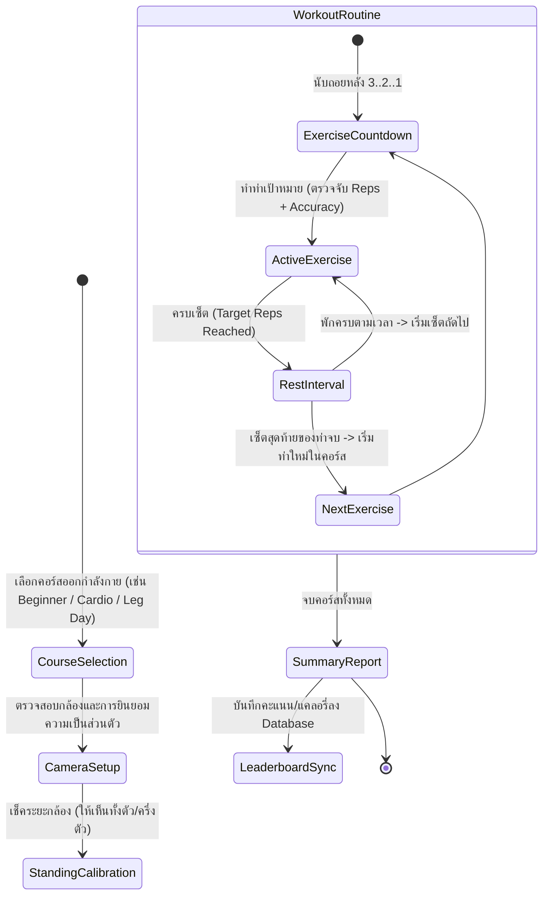

# แผนงานปรับปรุงระบบ: จาก Dance Detector สู่ Smart AI Fitness Workout Tracker

## 1. บทนำและเป้าหมาย (Executive Summary)
เดิมระบบคือเว็บแอปพลิเคชันสำหรับตรวจจับท่าเต้น Meme (เช่น Dab, Six-Seven, Scuba, Brazil) ด้วย AI (MediaPipe Pose Landmarker) ผ่านกล้องเว็บแคมแบบ On-Device 100% 

**เป้าหมายใหม่**: เปลี่ยนแนวทาง (Pivot) ไปเป็น **"เว็บแอปพลิเคชันออกกำลังกายตามแผนการฝึก (Smart AI Fitness Routine)"**
- ยังคงจุดเด่นเดิมคือ **เปิดกล้องเว็บแคม ตรวจจับท่าแบบ Real-time บนเบราว์เซอร์ ปลอดภัยเรื่องความเป็นส่วนตัว (Privacy-first on-device processing)**
- ออกกำลังกายเป็น Course / Workout Routine มีจำนวนท่าที่ต้องทำ (Target Repetitions), จำนวนรอบ (Sets), และเวลาพักระหว่างเซ็ต (Rest Interval Timer) เหมือนการออกกำลังกายจริง
- มีคะแนนความถูกต้องของฟอร์ม (Pose Accuracy Score) และระบบสะสมแต้ม/สตรีคเพื่อสร้างแรงจูงใจ (Gamification & Motivation)
- มีระบบคำนวณการเผาผลาญพลังงานแคลอรี่คร่าวๆ (Estimated Calories Burned) โดยอิงตามน้ำหนักผู้ใช้ (User Weight) หรือค่าเฉลี่ยมาตรฐาน (Default 65 kg) ร่วมกับค่า MET (Metabolic Equivalent of Task) ของแต่ละท่าและจำนวนครั้ง/เวลาที่ออกกำลังกาย
- ปรับปรุง/ต่อยอด Asset เดิม และสถาปัตยกรรมเดิม (Vanilla JS + CSS Design System + FastAPI/PostgreSQL Backend) ให้รองรับการทำงานได้อย่างสมบูรณ์

---

## 2. การวิเคราะห์ท่าออกกำลังกายและโครงสร้างข้อมูล (Exercise & Pose Library)

### 2.1 รายการท่าออกกำลังกายหลัก (Exercise Pose Suite)
เราสามารถนำสูตรคำนวณเวกเตอร์เรขาคณิต (`dist`, `angle`, `smoothstep`) และ State Machine การนับครั้งเดิมมาปรับใช้เป็นท่าออกกำลังกายที่มีประโยชน์จริง:

1. **Squats (สควอท - ขาและสะโพก)**
   - **Landmarks**: Hip (23/24), Knee (25/26), Ankle (27/28)
   - **เกณฑ์การนับ Rep**:
     - *Stand (Starting/Ending)*: มุมข้อเข่า > 160°
     - *Squat Down (Inflection Point)*: มุมข้อเข่า < 100° (หรือ 90°-110°)
     - ตรวจสอบหลังตรง (Trunk angle เทียบแนวตั้ง)
   - **MET ค่าความเข้มข้น**: ~5.0 - 5.5 METs

2. **Jumping Jacks (กระโดดตบ - คาร์ดิโอเบิร์นไขมัน)**
   - **Landmarks**: Wrists (15/16), Shoulders (11/12), Ankles (27/28), Hips (23/24)
   - **เกณฑ์การนับ Rep**:
     - *Close*: แขนลงข้างตัว (Wrists ต่ำกว่า Hip), ขาชิด (ระยะห่าง Ankle < ระยะห่าง Shoulder)
     - *Open*: มือแตะหรือชิดกันเหนือหัว (Wrists สูงกว่า Nose), ขากางออก (ระยะห่าง Ankle > 1.5 เท่าระยะห่าง Shoulder)
   - **MET ค่าความเข้มข้น**: ~8.0 METs

3. **High Knees (วิ่งยกเข่าสูง - คาร์ดิโอ & แกนกลางลำตัว)**
   - **Landmarks**: Hips (23/24), Knees (25/26), Ankles (27/28)
   - **เกณฑ์การนับ Rep**:
     - สลับยกเข่าซ้ายและขวาขึ้นมาให้อยู่ระดับสะโพก (มุม Hip-Knee ขนานพื้นหรือข้อเข่าสูงเกินแนวสะโพก)
     - นับคะแนนความต่อเนื่องและจังหวะ (คล้ายคลึงกับกลไกสลับข้างของ Six-Seven / Brazil เดิม)
   - **MET ค่าความเข้มข้น**: ~8.0 METs

### 2.2 ท่าออกกำลังกายเฉพาะส่วนและท่าใช้อุปกรณ์ดัมเบล (Targeted & Dumbbell Exercises)
เพื่อรองรับผู้เล่นระดับสูง (Advanced) และการเลือกเล่นแยกตามสัดส่วนกล้ามเนื้อ (Split Routine) โดยไม่จำเป็นต้องใช้เครื่องออกกำลังกาย (Bodyweight หรือใช้ Dumbbell สูงสุด):

4. **Dumbbell Bicep Curls (ท่อนแขนด้านหน้า / Biceps)**
   - **อุปกรณ์**: Dumbbells (หรือขวดน้ำ)
   - **Landmarks**: Shoulder (11/12), Elbow (13/14), Wrist (15/16)
   - **เกณฑ์การตรวจจับ**:
     - *Start/Down*: แขนเหยียดตรง ข้อศอกทำมุม > 150° และข้อศอกแนบลำตัว
     - *Curl Up*: ยกมือขึ้นจนมุมข้อศอก < 60° (บีบ Biceps) พร้อมตรวจจับไม่ให้ข้อศอกแกว่งไปข้างหน้า
   - **MET**: ~4.5 METs

5. **Dumbbell Shoulder Overhead Press (ไหล่และแขนส่วนบน / Shoulders & Deltoids)**
   - **อุปกรณ์**: Dumbbells
   - **Landmarks**: Wrists (15/16), Elbows (13/14), Shoulders (11/12)
   - **เกณฑ์การตรวจจับ**:
     - *Starting Position*: ข้อศอกพับ 90° ขนานแนวไหล่ มือจับดัมเบลระดับใบหู
     - *Press Up*: ดันดัมเบลขึ้นตรงเหนือศีรษะจนแขนเหยียดเกือบตรง (มุมศอก > 160°)
   - **MET**: ~5.0 METs

6. **Dumbbell Goblet Squat / Lunges (ขา ก้น และสะโพกเข้มข้น / Lower Body Power)**
   - **อุปกรณ์**: Dumbbell 1 ลูก (ถือระดับหน้าอก) หรือ Bodyweight
   - **Landmarks**: Hips (23/24), Knees (25/26), Ankles (27/28), Wrists (15/16)
   - **เกณฑ์การตรวจจับ**: ย่อเข่าจนต้นขาขนานพื้น (มุมเข่า 90°-100°) ขณะที่มือถือดัมเบลนิ่งอยู่ระดับอก
   - **MET**: ~6.0 - 6.5 METs

7. **Standing Cross Crunches / Torso Twists (แกนกลางลำตัวและซิกแพค / Core & Abs)**
   - **อุปกรณ์**: Bodyweight หรือถือ Dumbbell สองมือ
   - **Landmarks**: Elbows (13/14), Knees (25/26), Shoulders (11/12)
   - **เกณฑ์การตรวจจับ**: ดึงศอกข้างหนึ่งและยกเข่าฝั่งตรงข้ามเข้าหากัน (Cross crunch) ตรวจจับระยะห่างศอกกับเข่าบิดตัวเกร็งหน้าท้อง
   - **MET**: ~5.5 METs

---

### 2.3 โครงสร้างคอร์สออกกำลังกาย (Workout Courses & Targeted Splits)
ระบบแบ่งคอร์สออกเป็นหมวดหมู่ตามความยากและกลุ่มกล้ามเนื้อ:

```json
{
  "courses": [
    {
      "course_id": "beginner_fullbody",
      "category": "Full Body",
      "name": "Beginner Full Body Burn",
      "difficulty": "Easy",
      "equipment": "None (Bodyweight)",
      "target_calories_est": 45,
      "exercises": [
        { "pose_key": "jumping_jacks", "name": "Jumping Jacks", "target_reps": 15, "sets": 2, "rest_seconds": 20, "met": 8.0 },
        { "pose_key": "squats", "name": "Bodyweight Squats", "target_reps": 10, "sets": 2, "rest_seconds": 30, "met": 5.0 },
        { "pose_key": "high_knees", "name": "High Knees", "target_reps": 20, "sets": 2, "rest_seconds": 25, "met": 8.0 }
      ]
    },
    {
      "course_id": "adv_upper_body",
      "category": "Upper Body (แขน/ไหล่)",
      "name": "Advanced Upper Body Sculpt",
      "difficulty": "Hard",
      "equipment": "Dumbbells",
      "target_calories_est": 85,
      "exercises": [
        { "pose_key": "bicep_curls", "name": "Dumbbell Bicep Curls", "target_reps": 12, "sets": 3, "rest_seconds": 30, "met": 4.5 },
        { "pose_key": "shoulder_press", "name": "Dumbbell Shoulder Press", "target_reps": 10, "sets": 3, "rest_seconds": 35, "met": 5.0 },
        { "pose_key": "jumping_jacks", "name": "Fast Jumping Jacks (Burnout)", "target_reps": 25, "sets": 2, "rest_seconds": 20, "met": 8.5 }
      ]
    },
    {
      "course_id": "adv_lower_power",
      "category": "Lower Body (ขา/ก้น)",
      "name": "Advanced Leg & Glute Power",
      "difficulty": "Hard",
      "equipment": "Dumbbells or Bodyweight",
      "target_calories_est": 95,
      "exercises": [
        { "pose_key": "squats", "name": "Goblet Squats (Hold Dumbbell)", "target_reps": 15, "sets": 3, "rest_seconds": 35, "met": 6.5 },
        { "pose_key": "high_knees", "name": "Explosive High Knees", "target_reps": 30, "sets": 3, "rest_seconds": 30, "met": 8.5 }
      ]
    },
    {
      "course_id": "adv_core_abs",
      "category": "Core & Abs (แกนกลางลำตัว)",
      "name": "Standing Core Shredder",
      "difficulty": "Medium-Hard",
      "equipment": "Bodyweight",
      "target_calories_est": 70,
      "exercises": [
        { "pose_key": "standing_crunches", "name": "Standing Cross Crunches", "target_reps": 20, "sets": 3, "rest_seconds": 25, "met": 5.5 },
        { "pose_key": "high_knees", "name": "Sprint High Knees", "target_reps": 25, "sets": 2, "rest_seconds": 20, "met": 8.0 }
      ]
    }
  ]
}
```


---

## 3. กลไกการคำนวณแคลอรี่และระบบคะแนน (Form Score & Calories Engine)

### 3.1 การคำนวณแคลอรี่ (Calories Calculation Formula)
ใช้มาตรฐานสากลอิงค่า **MET (Metabolic Equivalent of Task)**:
$$\text{Calories Burned (kcal)} = \left(\frac{\text{MET} \times 3.5 \times \text{Weight (kg)}}{200}\right) \times \left(\frac{\text{Duration (seconds)}}{60}\right)$$
- **Weight**: ดึงจากข้อมูล Profile ของผู้ใช้ (หากไม่ระบุ ให้ใช้ค่าเฉลี่ย Default 65 กก.)
- มีโบนัสแคลอรี่คำนวณตามความเร็วและความต่อเนื่องของ Reps

### 3.2 ระบบคะแนนและแรงจูงใจ (Form Accuracy & Gamification)
- **Form Accuracy (0-100%)**: วัดความลึกของการย่อ (Squat depth), ความกว้างของการกระโดดตบ, ความตรงของลำตัว
- **Audio/Visual Feedback**:
  - สีโครงกระดูก Canvas เปลี่ยนตามความถูกต้อง (เขียว = ฟอร์มเป๊ะ, ส้ม = ใกล้ถึง, แดง = ฟอร์มยังไม่ได้)
  - มีเสียง Beep หรือ Synth Audio (Web Audio API) เมื่อนับสำเร็จ 1 Rep และเสียงเตือนหมดเวลาพัก
- **Workout Summary Badges**:
  - "Perfect Form" (ความแม่นยำเฉลี่ย > 90%)
  - "Calorie Crusher" (เบิร์นมากกว่า 50 kcal ใน 1 เซสชั่น)
  - "Streak Master" (เล่นติดต่อกันหลายวัน)

---

## 4. โฟลว์การใช้งานใหม่ (User Journey & State Machine)



---

## 5. แผนการเปลี่ยนแปลงไฟล์และโค้ด (Proposed Changes)

### 5.1 Frontend Architecture
- **`frontend/js/config.js`**:
  - เปลี่ยนจาก `POSES: { dab, six_seven, scuba, brazil }` เป็น `EXERCISES: { squats, jumping_jacks, high_knees }` และเพิ่มนิยาม `COURSES`
- **`frontend/js/exercises/`**:
  - สร้างไฟล์แยกสำหรับท่าออกกำลังกายใหม่:
    - `squat.js`: ตรวจจับมุมสะโพก-เข่า-ข้อเท้า
    - `jumping_jack.js`: ตรวจจับแขนยกเหนือศีรษะและขากาง
    - `high_knee.js`: ตรวจจับการยกเข่าระดับเอวสลับข้าง
    - `calories.js`: โมดูลคำนวณแคลอรี่แบบ real-time
- **`frontend/js/workout_manager.js`**:
  - คุม State Machine ใหญ่: จัดการลำดับท่า, จำนวน Set, รอบ Rest Interval พักเหนื่อย, และสถานะ Workout Complete
- **`frontend/pages/play.html` & `frontend/css/style.css`**:
  - ปรับ UI ให้เป็นธีม Fitness Studio สไตล์พรีเมียม (Dark Mode พร้อม Neon Accent)
  - เพิ่ม UI ส่วน Workout Status:
    - **Current Exercise**: ชื่อท่า + ตัวอย่างฟอร์ม
    - **Set / Reps Tracker**: เช่น `Set 1/3` | `Rep 7/12`
    - **Rest Interval Overlay**: นาฬิกานับถอยหลังช่วงพักพร้อมข้อความ "พัก ดื่มน้ำ และเตรียมตัว"
    - **Calories Counter HUD**: ตัวเลขอัตราการเผาผลาญแคลอรี่สะสมแบบสดๆ (e.g. `🔥 24.5 kcal`)
- **`frontend/index.html` & `frontend/pages/leaderboard.html`**:
  - ปรับหน้าแรกเป็นการแนะนำคอร์สออกกำลังกาย (Featured Courses)
  - Leaderboard แสดงอันดับผู้ที่ออกกำลังกายมากที่สุด (Top Calories Burned / Total Workouts Completed)

### 5.2 Backend & Database Architecture
- **`backend/app/models.py`**:
  - ขยายตาราง `scores` ให้รองรับ `calories_burned`, `course_key`, `duration_seconds`, `completed_sets`
- **`backend/app/routers/`**:
  - อัปเดต API endpoint ในการรับข้อมูลสรุปผลการออกกำลังกาย และดึง Leaderboard รายวัน/สัปดาห์

---

## 6. แผนการตรวจสอบและทดสอบ (Verification Plan)

1. **Camera & Pose Detection Verification**:
   - ทดสอบเปิดกล้องและการเรนเดอร์ Skeleton บนเบราว์เซอร์
   - ทดสอบความแม่นยำในการนับ Rep ของท่า Squat, Jumping Jacks, High Knees
2. **State Machine & Rest Interval Test**:
   - ทดสอบลูปการเล่น: ทำครบเป้า Rep -> เข้าสู่ช่วง Rest Timer -> เริ่มต้นเซ็ตถัดไปได้อย่างราบรื่น
3. **Calorie Calculation Sanity Test**:
   - ตรวจสอบสูตรคำนวณแคลอรี่ว่าได้ตัวเลขที่สมเหตุสมผลตามหลักสรีรวิทยา
4. **Backend Sync & Leaderboard Test**:
   - ตรวจสอบการส่งข้อมูลสรุปเซสชั่นผ่าน API และความถูกต้องของข้อมูลใน PostgreSQL
